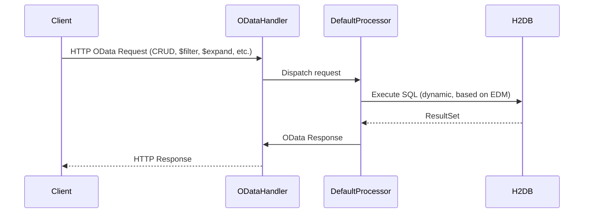
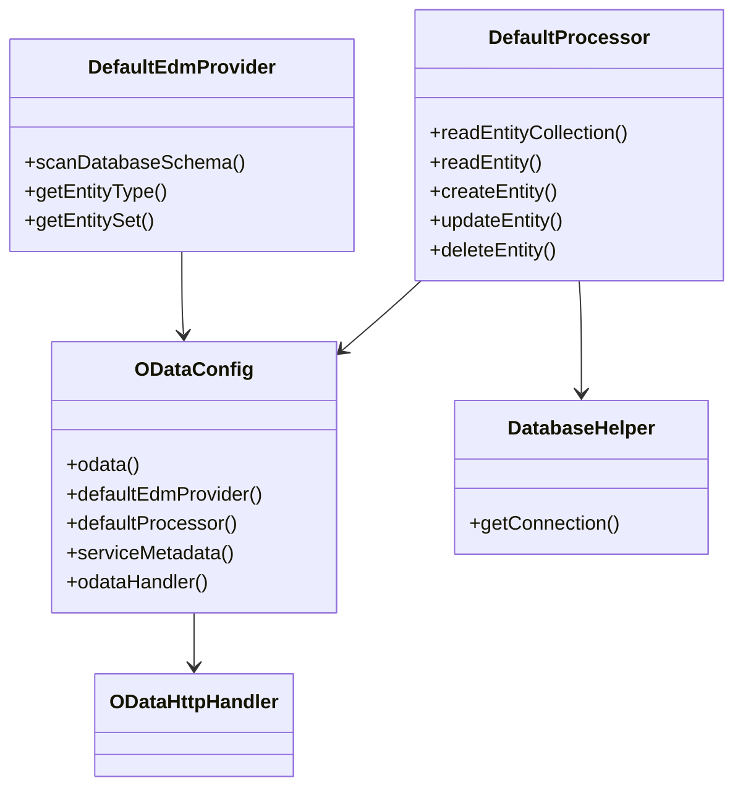

# OData Server Architecture

## Overview

This project is a dynamic OData v4 server built with Apache Olingo, Spring Boot, and H2. It supports CRUD, $filter, $orderby, $expand, and $count operations, with dynamic EDM generation from the database schema.

## Main Components

- **DefaultEdmProvider**: Scans the database schema and generates EDM types and entity sets dynamically.
- **DefaultProcessor**: Handles OData requests, maps them to SQL, processes CRUD and navigation property logic.
- **ODataConfig**: Spring Boot configuration for OData beans and handler.
- **DatabaseHelper**: Manages H2 database connections.
- **Integration Tests**: Validate API and DB consistency, including CRUD, $filter, $orderby, $expand, $count, and error handling.

## Sequence Diagram

## Class Diagram

## Integration Test Coverage

- **ODataIntegrationTest**: Covers all API endpoints and scenarios:
    - CRUD operations for Products and Categories
    - $filter (e.g., Price gt N)
    - $orderby (e.g., Price desc)
    - $expand (navigation property: Product->Category)
    - $count (entity collection count)
    - Error handling (invalid queries, missing entities)
    - DBUnit-based test data setup and validation

## Technical Details

- **Entity Sets**: Plural names for OData, singular for DB tables.
- **Navigation Properties**: Supports $expand for relationships (e.g., Product->Category).
- **Dynamic EDM**: Entity types and sets are generated from the live DB schema.
- **Renamed Classes**: `TestEdmProvider` → `DefaultEdmProvider`, `TestProcessor` → `DefaultProcessor`.

## References

- [`DefaultEdmProvider`](server/src/main/java/com/example/DefaultEdmProvider.java:17)
- [`DefaultProcessor`](server/src/main/java/com/example/DefaultProcessor.java:40)
- [`ODataConfig`](server/src/main/java/com/example/ODataConfig.java:14)
- [`ODataIntegrationTest`](server/src/test/java/com/example/integration/ODataIntegrationTest.java:1)